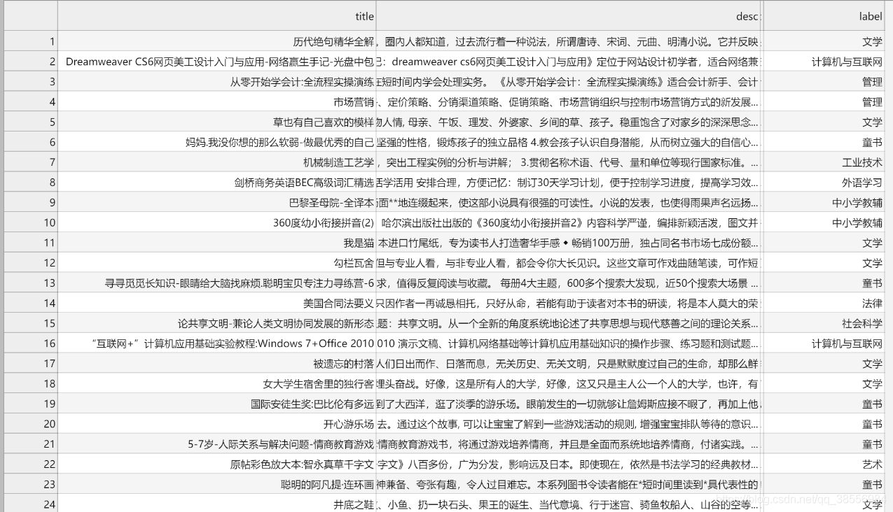

### 文件说明与运行

数据源来自于京东电商， 任务是基于图书的相关描述和图书的封面图片，自动给一个图书做类目的 分类。这种任务也叫作多模态分类。

在本项目中，我们使用的是京东图书数据。在京东网站上，每一本图书都录 属于列表中的一个类目，如图 1所示。由于本项目中需要实现的是单标签多 类别的分类模型，我们决定使用图书的二级类目作为样本的真实标签，比如
“中国文学”，“纪实文学”，“青春校园”等。在给定的数据集中，一共包含 33 个不同类别的标签。

## 具体给出的实现方式有三种：

#### 1. 特征工程（图片特征、Tfidf特征、LDA特征、窗口词向量、包括label交互词向量、bert预训练句向量、基本NLP特征）+ GBDT

#### 2. 机器学习模型（包括RandomForestClassifier随机森林，LogisticRegression逻辑回归，MultinomialNB朴素贝叶斯，SVC支持向量机，LightGBM梯度提升决策树等等）

#### 3. 深度学习模型（包括RNN、CNN、RCNN、RNN_ATT、Transformer、BERT、XLNet、Roberta等等）

## 代码结构

#### data/

        数据存放目录
#### model/

        模型存放目录
#### logs/

        日志存放目录

#### app.py

        代码部署部分
#### src/

        核心代码部分

#### `src/data`

        `src/data/dataset.py` : 主要用于深度学习的数据处理
        `src/data/mlData.py` : 主要用于机器学习的数据处理
        `src/data/dictionary.py` : 生成词表， 能够根据id确定词， 或者根据词确定id

#### `src/word2vec/`

        `src/word2vec/embedding.py`: tfidf, word2vec, fasttext, lda 的训练，保存加载。
        `src/word2vec/autoencoder.py`: autoencoder的训练，保存加载。

#### `src/utils/`

        `src/utils/config.py`: 相关参数的配置文件， 如训练数据集所在目录， DL模型相关参数等等
        `src/utils/feature.py`: 特征工程相关的函数
        `src/utils/tools.py`: 通用类函数

#### `src/ML/`

        `src/ML/fasttext.py`: fasttext 模型训练，预测， 保存
        `src/ML/main.py`: 机器学习类模型总入口
        `src/ML/model.py`: 包含特征工程，参数搜索， 不平衡处理， lightgbm的预测

#### `src/DL/`

        `src/DL/train.py`: 深度学习模型训练主入口
        `src/DL/train_helper.py`: 深度学习模型实际训练函数

#### `src/DL/models`:

        深度学习模型

在这个实战中，可以掌握学习到以下的代码实践：

* 文本特征提取：任何建模环节都需要特征提取的过程，你将会学到如何使用 tfidf、wor2vec、FastText 等技术来设计文本特征。
* 图片特征提取：由于项目是多模态分类，图片数据也是输入信号的一 部分。你可以掌握如何通过预训练好的 CNN 来提取图片的特征， 并且结合文本向量一起使用。
特征工程搭建：对于一个文本，如何使用更多的特征，包括 LDA特征、窗口词向量、包括label交互词向量、bert预训练句向量、基于统计的基本NLP特征等等。
* 标签不平衡处理：由于本项目数据集中的标签类别较多，但是不同类别样本的数量差异较大， 即存在标签不平衡的情况。为了解决该问题，引入了BalancedBaggingClassifier、 SMOTE 和 ClusterCentroids。
* 参数搜索优化：由于使用模型参数比较多，所以要进行参数选择优化，这里我们包括网格搜索优化和贝叶斯优化。
* 经典机器学习模型搭建：包括RandomForestClassifier随机森林，LogisticRegression逻辑回归，MultinomialNB朴素贝叶斯，SVC支持向量机，GBDT梯度提升决策树等等。
经典的深度学习模型：包括RNN、CNN、RCNN、RNN_ATT、Transformer、BERT、XLNet、Roberta等等。

###数据集

对于标签的识别，我们主要采用两种数据，第一种是图书的内容简介，包括title、desc以及 label，如下图示：

